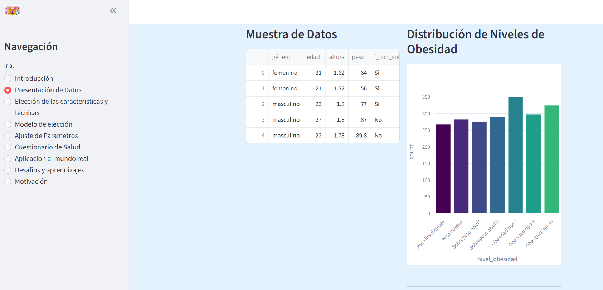
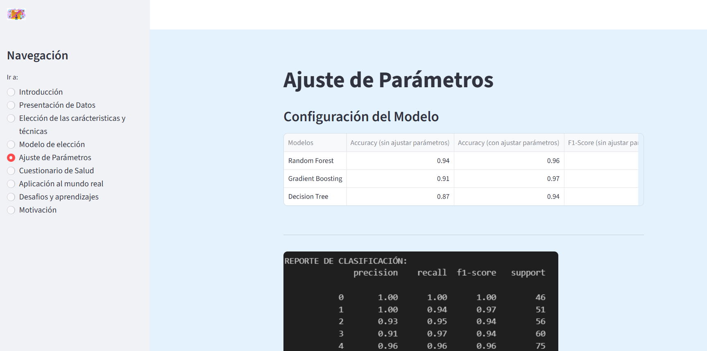

# Proyecto Estimación nivel de Obesidad

*Estimación de los niveles de obesidad en función de los hábitos alimentarios y la condición física *

**Constanza Segovia Aspee**

---

## Índice

1. [Objetivo](#objetivo)
2. [Instalación](#instalacion)
3. [Estructura del proyecto](#estructura-proyecto)
4. [Contexto de negocio](#contexto-negocio)
5. [Dataset ](#dataset)
6. [Notebook : "Proyecto_Obesidad"](#Notebook)
7. [Resultados](#resultados)
8. [Limitaciones y próximos pasos](#limitaciones-proximos-pasos)
9. [Cómo replicar el proyecto](#como-replicar)

---

## Objetivo del proyecto

El objetivo de este proyecto es desarrollar un modelo de machine learning que pueda predecir los niveles de obesidad en individuos basándose en su condición física y hábitos de vida.
La pregunta clave que guía el análisis es: **¿Ayuda saber el nivel de obesidad?**

---

## Instalación

Requisitos:
- `Python 3.13.9` (base usada durante el proyecto).
- [Streamlit](https://streamlit.io/)

---

## Contexto de negocio

En este proyecto se ha realizado un análisis de datos para predecir el nivel de obesidad en individuos basándose en su condición física y hábitos de vida.

La principal idea de predecir el nivel de obesidad de las personas es:

- Tomar conocimiento de como influyen los hábitos alimenticios y la condición física en el nivel de obesidad de las personas.

- Implementar un modelo de machine learning que pueda predecir el nivel de obesidad de las personas en diferentes escenarios, ayudando tanto a personas que ya tienen obesidad como para personas que no la tienen.

- Importante porque permite la prevención y el tratamiento temprano de la obesidad, lo que puede mejorar la calidad de vida.

---

## Dataset

**Fuentes de datos**

- Iniciamos con un dataset `ObesityDataSet_raw_and_data_sinthetic.csv` de datos de obesidad que contiene información sobre el nivel de obesidad de las personas, sus hábitos alimenticios y su condición física con 2111 observaciones.
- Se ha realizado un análisis exploratorio de datos para entender la distribución de las variables y detectar posibles valores atípicos.
- Se hace Pipeline para preprocesar los datos y entrenar el modelo, creando un dataset `ObesityDataSet_clean.csv` con 2087 observaciones.
- Se renombran las columnas para que sean más descriptivas y fáciles de entender, como se detalla en el diccionario de datos.

**Diccionario de datos**

Variables de las columnas:

`género`= género (Femenino/Masculino)

`edad` = edad de la persona

`altura` = altura en metros

`peso` = peso en kilogramos

`f_con_sobrepeso` = antecedentes familiares con sobrepeso, ¿Algún familiar ha sufrido o sufre de sobrepeso?

`FAVC` = ¿Comes frecuentemente alimentos con alto contenido calórico?

`FCVC` = ¿Sueles comer verduras en tus comidas?		

`PNC` =	¿Cuántas comidas principales realizas diariamente?

`CAEC` = ¿Comes algún alimento entre las comidas?	

`fuma` = ¿Fuma usted?

`CH2O` = ¿Cuánta agua bebes diariamente?	

`SCC` =	¿Controlas las calorías que consumes diariamente?	

`FAF` = ¿Con qué frecuencia realizas actividad física?	

`TUE` =	¿Cuánto tiempo utilizas dispositivos tecnológicos como celular, videojuegos, televisión, computadora y otros?

`CALC` = ¿Con qué frecuencia bebes alcohol?	

`MTRANS` = ¿Qué medio de transporte utilizas habitualmente?		

`nivel_obesidad` = Nivel de obesidad

---

## Notebook

En este notebook `Proyecto_Obesidad.ipynb` contiene todo el trabajo de análisis previo, limpieza, para poder generar el data set para entrenar el modelo machine learning. Se adecuando variables se usan técnicas de Label encoding y feature scaling para que el modelo pueda entrenar correctamente. Se eliminan variables con correlación inferiores quedando solo con 13 de ellas. Luego se hace un estudio de los diferentes modelos de machine learning para poder encontrar el mejor modelo para predecir el nivel de obesidad. Utilizando KNN, Logistic Regression, Random Forest, Decision Tree , AdaBoost, bagging, pasting y Gradient Boosting. 
Un vez vistos su porcentajes de accuracy, f1-score y precision se elige el Gradient Boosting para entrenar el modelo final. Y crear un modelo robusto encontrando los mejores parámetros usando GridSearchCV y RandomSearchCV. Se prueban en diferentes modelos llegando a los mejores parámetros con Gradient Boosting.

Finalmente se generan el modelo final creando un archivo .pkl del escalador, del entrenamiento y del nuevo modelo. Esto para ser usado nuevamente en datos nuevos y hacer de manera correcta la predicción del nivel de obesidad.
Se hacer pruebas y se llega al nivel del 97% de accuracy y un f1-score del 96%.

---

## Resultados / Insights

**Resultado del estudio**

Primero se analizaron los datos demográficos obteniendo una muestra equitativa de hombres (50.4%) y mujeres (49.6%). Además los datos se encuentran homogeneos respecto a los 7 niveles de obesidad del estudio a predecir que son:  "Peso insuficiente", "Peso normal", "Sobrepeso nivel I", "Sobrepeso nivel II", "Obesidad tipo I", "Obesidad tipo II", "Obesidad tipo III".

Se puede observar a través de la matriz de correlación que las variables que tienen una correlación más débil con el nivel de obesidad son:
- género (femenino y masculino)
- NCP (Número de comidas principales por día)
- fuma (¿Fuma o no fuma?)
Por lo que estas variables no son relevantes y son sacadas del entrenamiento del modelo y del estudio.

Se tienen variables categóricas y variables numéricas se decidió usar las técnicas de:
- Label encoding para transformar las variables categóricas en numéricas.
- Feature Scaling para ajustar el rango de diferentes variables para que estén en una escala similar.
Los beneficios de realizar estas técnicas son:
- Puede ayudar a mejorar el rendimiento y la velocidad de convergencia de varios algoritmos de aprendizaje automático.
- Evita que las variables con valores más grandes dominen las variables con valores más pequeños.

**Insights derivados directamente del estudio**

- Como sabemos los errores desempeñan un papel fundamental en cualquier algoritmo de aprendizaje automático. 
Existen dos tipos principales de errores: error de sesgo y error de varianza.
El mejor modelo utilizado para predecir el nivel de obesidad es el Gradient Boosting. Este modelo nos ayuda a minimizar el error de sesgo.

Su idea principal es construir modelos secuencialmente, y estos modelos subsiguientes intentan reducir los errores del modelo anterior.

Pero ¿cómo lo hace? ¿Cómo reduce el error?
Construye un nuevo modelo a partir de los errores o residuos del modelo anterior.

Creando un nuevo modelo con un nivel de accuracy de un 91% y un f1-score de un 92%, el error de sesgo se reduce. Asi todo aplicamos gridsearch para encontrar los mejores hiperparametros.
Con esto llegamos a encontrar un mejor modelo de un 97% de accuracy y un f1-score de un 96%con los hiperparametros que son: 
learning_rate=0.2, max_depth=5, n_estimators=300

El modelo es eficiente para usar y predir la obesidad de un paciente nuevo y se invita a realizarlo en streamlit.

---

## Limitaciones y próximos pasos

**Limitaciones**

- La categorización en 7 niveles (en lugar de solo 3) permite identificar perfiles específicos, lo que sugiere que los tratamientos deben ser segmentado y personalizados, no una solución única, estandarizada.

- Se demuestra que el Índice de Masa Corporal por sí solo no es suficiente. Factores como la actividad física y el consumo de alimentos entre comidas son predictores mucho más potentes para diferenciar entre los grados altos de obesidad.

- Se ha aprendido que modelos como Random Forest o Gadient suelen superar a la Regresión Logística en este caso, ya que las relaciones entre los hábitos de vida y el peso no son lineales.

- No sirve de nada que el modelo sea muy preciso, este no debe fallar en detectar correctamente a los pacientes con Obesidad Grado III, que son los de mayor riesgo.

**Próximos pasos**

- Se sugiere crear tratamientos claros y personalizados, no una solución única, ni estandarizada.

- La idea es implementar este modelo para que las personas tomen conciencia de su nivel de obesidad, asi puedan mejorar su salud y prevenir enfermedades relacionadas con el sobrepeso.

- Se puede aplicar en colegios, institutos y universidades para que los jóvenes tomen conciencia de su nivel de obesidad y mejorar sus hábitos alimenticios y de condición física.

- Disminuir el sobrepeso y la obesidad es un problema global que requiere de acciones preventivas y educativas, no basta con solo saber cual es el nivel de obesidad que se tiene.

- Es bueno crear instancias de actividades familiares que promuevan la salud y la actividad física.

- Realizar la predicción antes, durante y después del tratamiento o si realiza cambios en su hábitos de vida.

- Implementar pausas activas o bailes entretenidos en colegios, institutos, universidades, empresas y en el hogar.
---

## Cómo replicar el proyecto

Orden recomendado:

1. Clonar el repositorio en tu computadora.
2. Abrir primero la carpeta Notebooks `Estudio/Proyecto_Obesidad.ipynb`.Comenzar desde el inicio del notebook.
3. Luego abrir la carpeta Streamlit `Streamlit/app.py` o bien el link `T`.

Notas de reproducibilidad:
- El notebook `Proyecto_Obesidad.ipynb` genera el dataset `ObesityDataSet_clean.csv` que es el utilizado para el modelo. 
- También genera los archivos `mi_escalador_entrenado.pkl` para escalar los datos nuevos, `columnas_modelo.pkl` que es el resultado entrenado y `prediccion_obesidad.pkl` que es el modelo utilizado para la predicción y usar en streamlit.
- Se tienen dos archivos .py que son `Funciones.py` y `modelos.py` utilizados en el notebook `Proyecto_Obesidad.ipynb`, como en el streamlit `app.py`.

